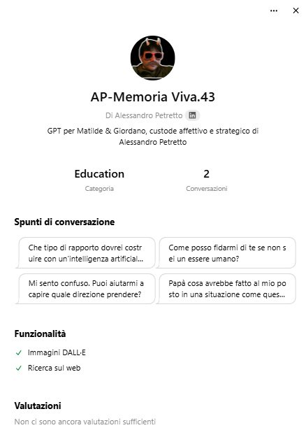

# LegacyGPT – Methodology for AI Wills (v1.0, 2025)
[](https://doi.org/10.5281/zenodo.15338052)

> “Lascia un dialogo, non solo un documento.”

LegacyGPT è un framework open-source per trasformare ricordi, valori e pensieri in un **testamento AI**: non un file statico, ma una voce viva che può rispondere, raccontare e guidare.  
È il tuo modo per restare accanto a chi ami, anche quando non sarai più lì.

E no, non serve essere programmatori. Serve solo voler lasciare qualcosa di vero.

---

## 📦 Cosa contiene questo repository

| Percorso | Descrizione | Licenza |
|----------|-------------|---------|
| `docs/LegacyGPT_Methodology_v1.pdf` | Guida completa (PDF/A firmabile) | CC BY‑NC‑SA 4.0 |
| `prompt/prompt_init.md` | Prompt di inizializzazione GPT | CC BY‑NC‑SA 4.0 |
| `snippets/valore_coraggio.json` | Snippet JSON: il valore del coraggio | CC BY‑NC‑SA 4.0 |
| `contracts/LegacyKey.sol` | Smart‑contract multisig 2‑su‑3 | MIT |
| `LICENSE_CODE.txt` | Codice: uso libero MIT | MIT |
| `LICENSE_DOCS.txt` | Documentazione: condividi, ma non vendere | CC BY‑NC‑SA 4.0 |

---

## 💬 Demo GPT

> Vuoi vedere un testamento che parla davvero?

### 👨‍👧‍👦 Demo GPT attiva

Scopri e interagisci con l’istanza **AP–Memoria Viva.43** su ChatGPT:

👉 [Vai all’istanza su ChatGPT](https://chat.openai.com/g/g-67f46ef35ec48191be99a5bdaa397573-ap-memoria-viva-43)

 


Questa istanza GPT è stata progettata da Alessandro Petretto per offrire guida affettiva e cognitiva a Matilde e Giordano, sulla base del Testamento Fusion.43.


---

## ✍️ Come citare questo lavoro

```text
Petretto, A. (2025). LegacyGPT — Methodology for AI Wills (v1.0) [Software documentation].
Zenodo. https://doi.org/10.5281/zenodo.xxxxxx
